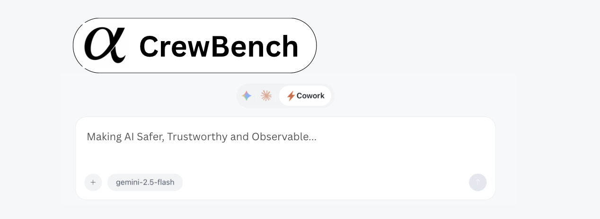

# CrewBench

> CrewBench is not about making AI smarter.   It is about making AI safer, observable, and trustworthy for real software work.

CrewBench is a **desktop UI and control layer for AI coding agents** such as Claude Code, Gemini CLI, and Codex.

It provides **visibility, control, and rollback** over how AI agents read and modify a real codebase.

CrewBench is built on top of **[AionUi](https://github.com/iOfficeAI/AionUi) (Apache-2.0)** and inherits all upstream AionUi capabilities, while adding **developer-focused observability and guardrails**.

---

## Overview

CrewBench runs as a desktop application where:

- AI coding agents operate through their existing CLIs
- Agents can read and write real project files
- Every file change is tracked, diffed, and reversible
- Developers remain in control of agent scope and actions

This repository does **not** duplicate AionUi documentation.  
Instead, it extends AionUi with **engineering-grade tooling** around safety, traceability, and control.

---

## Relationship to AionUi

AionUi provides the base platform, including:

- Multi-agent orchestration
- Desktop UI infrastructure
- File system access
- Local-first execution
- Cross-platform support

CrewBench builds **on top of this foundation** and focuses specifically on **software engineering workflows**.

**AionUi documentation & full feature list:**  
https://github.com/iOfficeAI/AionUi

---

## File-Level Version Tracking (CrewBench Extension)

CrewBench adds **AI-aware file version tracking**, recording every agent-initiated change:

- Full content snapshots per change
- Line-based diffs between versions
- Operation type (`create`, `write`, `delete`)
- Agent attribution
- Timestamped history per workspace

Developers can:

- Inspect how a file evolved across agent actions
- Compare versions visually
- Revert a file to any previous state

This complements Git by tracking **agent behavior**, not commits.

---

## Technical Focus Areas

CrewBench development focuses on:

### Observability
- File timelines and diffs
- Clear agent vs human attribution
- Action-level history

### Control / Guardrails
- Path-based read/write restrictions
- Operation-level permissions
- Confirmation gates for risky actions

### Reproducibility
- Inspectable agent action sequences
- Debugging and diagnosis of AI behavior

### Human + Agent Workflows
- Continuous history across human and agent edits
- No context loss between steps

---

## What CrewBench Does Not Do

- Does not replace Git
- Does not replace an IDE
- Does not introduce new AI models
- Does not focus on prompt presets

CrewBench operates at the **control and observability layer**, not the editor or model layer.

---

## Architecture Notes

At a high level, CrewBench extends AionUi by:

- Hooking into agent file-write streams
- Persisting file revisions and metadata locally
- Exposing version history and diffs in the UI
- Enforcing policies before and during agent actions

All data remains local to the developer’s machine.

---

## Project Status

CrewBench is under active development.

This repository is intended for contributors interested in:

- Developer tooling
- AI safety in coding workflows
- Observability and auditability
- Desktop systems (Electron + Node.js)

Expect iterative changes as workflows evolve.

---

## Contributing

Contributions are welcome, especially in:

- Guardrail and policy enforcement
- File history and diffing
- Action logging and observability
- Developer workflow ergonomics

Guidelines:

- Avoid duplicating upstream AionUi functionality
- Keep changes focused and incremental
- Prioritize control and visibility over surface features

---

## License

CrewBench is licensed under the Apache License 2.0.

This project builds upon work from the AionUi project.  
All original licenses, notices, and attributions are preserved.
