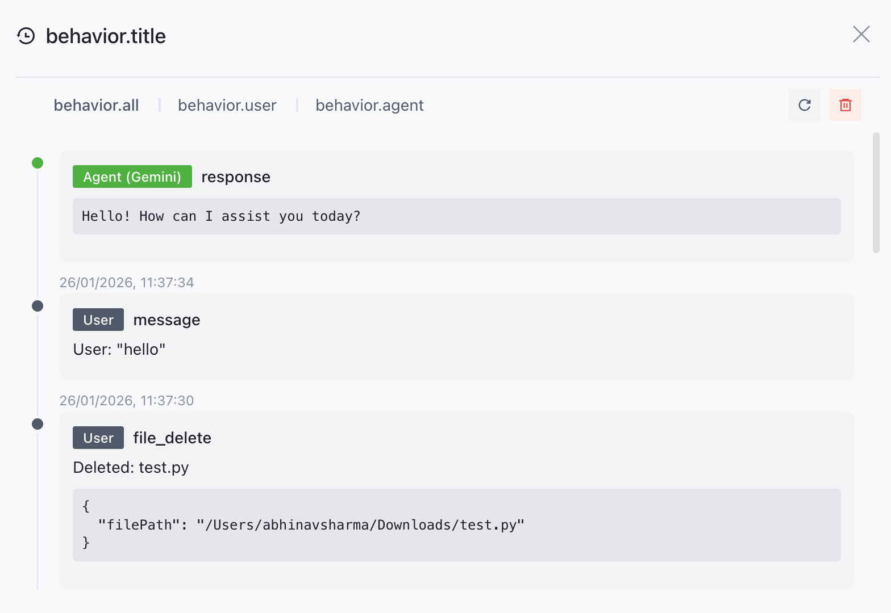

[![Contributors][contributors-shield]][contributors-url]
[![Forks][forks-shield]][forks-url]
[![Stargazers][stars-shield]][stars-url]
[![Issues][issues-shield]][issues-url]
[![project_license][license-shield]][license-url]

 

  

<h3 align="center">CrewBench</h3>

  

    An open-source, enhanced version of Claude Code built specifically for programmers.
     
    <a href="https://github.com/CrewBench/CrewBench"><strong>Explore the docs »</strong></a>
     
     
    <a href="#getting-started">Getting Started</a>
    &middot;
    <a href="https://github.com/CrewBench/CrewBench/releases">View Demo</a>
    &middot;
    <a href="https://github.com/CrewBench/CrewBench/issues/new?template=bug_report.yml">Report Bug</a>
    &middot;
    <a href="https://github.com/CrewBench/CrewBench/issues/new?template=feature_request.yml">Request Feature</a>
    &middot;
    <a href="#contact">Contact Us</a>
  

<!-- TABLE OF CONTENTS -->

  
Table of Contents

  <ol>
    <li>
      <a href="#overview">Overview</a>
      <ul>
        <li><a href="#core-features">Core Features</a></li>
        <li>
          <a href="#special-features">Special Features</a>
          <ul>
            <li><a href="#file-level-version-tracking-and-crewbench-logging">File Level Version Tracking</a></li>
            <li><a href="#action-logs">Action Logs</a></li>
          </ul>
        </li>
        <li><a href="#technical-focus-areas">Technical Focus Areas</a></li>
        <li><a href="#our-relationship-to-aionui">Relationship to AionUi</a></li>
        <li><a href="#what-crewbench-does-not-do">What CrewBench Does Not Do</a></li>
      </ul>
    </li>
    <li>
      <a href="#getting-started">Getting Started</a>
      <ul>
        <li><a href="#system-requirements">System Requirements</a></li>
        <li><a href="#prerequisites">Prerequisites</a></li>
        <li><a href="#installation">Installation</a></li>
      </ul>
    </li>
    <li>
      <a href="#crewbench-usage">CrewBench Usage</a>
      <ul>
        <li><a href="#cowork-with-cli-ai-agents">Cowork With CLI AI Agents</a></li>
        <li><a href="#cowork-directly-on-your-codebase">Cowork Directly on Your Codebase</a></li>
        <li><a href="#inspect-agent-output">Inspect Agent Output</a></li>
        <li><a href="#file-timeline-and-action-logs">File Timeline and Action Logs</a></li>
        <li><a href="#parallel-task-execution">Parallel Task Execution</a></li>
        <li><a href="#remote-coworking">Remote Coworking</a></li>
        <li><a href="#developer-controlled-interface">Developer-Controlled Interface</a></li>
      </ul>
    </li>
    <li><a href="#roadmap">Roadmap</a></li>
    <li><a href="#contributing-to-crewbench">Contributing</a></li>
    <li><a href="#license">License</a></li>
    <li><a href="#contact">Contact</a></li>
    <li><a href="#acknowledgments">Acknowledgments</a></li>
  </ol>

<!-- ABOUT THE PROJECT -->

## Overview

CrewBench is a **desktop UI and control layer for AI coding agents** such as Claude Code, Gemini CLI, and Codex.

It provides **visibility, control, and rollback** over how AI agents read and modify a real codebase.

CrewBench is built on top of **[AionUi](https://github.com/iOfficeAI/AionUi) (Apache-2.0)** and inherits all upstream AionUi capabilities, while adding **developer-focused observability and guardrails**.

## Core Features

| Feature                          | Description                                                                                                        |
| -------------------------------- | ------------------------------------------------------------------------------------------------------------------ |
| **Universal Model Support**      | Work with cloud and local models through a unified interface, including OpenAI-compatible APIs and local runtimes. |
| **Agent Coworking Environment**  | Multiple agents and tasks can run in parallel with isolated context, enabling real cowork-style workflows.         |
| **Direct File System Access**    | Agents operate directly on real project files via a file-tree interface, not abstract chat outputs.                |
| **File Timeline**                | Every file change is recorded in a chronological timeline, making agent activity inspectable and reviewable.       |
| **Action Logs & Audit Trail**    | Full logs of both AI and human actions provide observability, debugging capability, and reproducibility.           |
| **Live Preview & Editing**       | Generated artifacts are surfaced as editable, previewable files rather than hidden chat responses.                 |
| **Extensible & Customizable UI** | The interface is developer-controlled, supporting layout flexibility and custom CSS theming.                       |

### Special Features:

#### File Level Version Tracking and CrewBench Logging

CrewBench adds **AI-aware file version tracking**, recording every agent-initiated change:

- Full content snapshots per change
- Line-based diffs between versions
- Operation type (`create`, `write`, `delete`)
- Agent attribution
- Timestamped history per workspace

This complements Git by tracking **agent behavior**, not commits.

#### Action Logs

Action logs provide a comprehensive audit trail of all actions performed by agents and humans in the workspace. Each log entry includes:

- Timestamp
- Action type (create, write, delete)
- Agent attribution
- File path
- Content snapshots
- Line-based diffs

### Technical Focus Areas

| Focus Area                  | What It Covers                                                                                                  | Why It Matters                                                                           |
| --------------------------- | --------------------------------------------------------------------------------------------------------------- | ---------------------------------------------------------------------------------------- |
| **Observability**           | • File timelines and diffs • Clear agent vs human attribution • Action-level history                      | Lets developers _see exactly what happened_, who did it (human or AI), and in what order |
| **Control / Guardrails**    | • Path-based read/write restrictions • Operation-level permissions • Confirmation gates for risky actions | Prevents agents from touching the wrong files or making unsafe changes                   |
| **Reproducibility**         | • Inspectable agent action sequences • Debugging and diagnosis of AI behavior                                | Makes AI behavior debuggable, auditable, and repeatable                                  |
| **Human + Agent Workflows** | • Continuous history across human and agent edits • No context loss between steps                            | Enables seamless collaboration without losing state or intent                            |

### Our Relationship to AionUi

AionUi provides the base platform, including:

- Multi-agent orchestration
- Desktop UI infrastructure
- File system access
- Local-first execution
- Cross-platform support

CrewBench builds **on top of this foundation** and focuses specifically on **software engineering workflows**.

### What CrewBench Does Not Do

- Does not replace Git
- Does not replace an IDE
- Does not introduce new AI models
- Does not focus on prompt presets

CrewBench operates at the **control and observability layer**, not the editor or model layer.

## Getting Started

  

### System Requirements

- **macOS**: 10.15 or higher
- **Windows**: Windows 10 or higher
- **Linux**: Ubuntu 18.04+ / Debian 10+ / Fedora 32+
- **Memory**: Recommended 4GB or more
- **Storage**: At least 500MB available space

### Prerequisites

- CrewBench is a desktop application and does not require any prerequisites.

### Installation

1. Download the latest release from [here](https://github.com/CrewBench/CrewBench/releases).
2. Install the downloaded file.
3. Now you can run the `CrewBench as an Application` file.

(<a href="#readme-top">back to top</a>)

## CrewBench Usage

<strong id="cowork-with-cli-ai-agents">Cowork With CLI AI Agents (Unified Developer Interface)</strong>

CrewBench acts as a graphical cowork layer on top of existing command-line AI coding tools like Gemini CLI, Claude Code, Codex, Qwen Code, Goose, and more.

| Capability           | Description                                      |
| -------------------- | ------------------------------------------------ |
| Multi-Agent Sessions | Run multiple AI coding agents simultaneously     |
| Unified Interface    | One UI instead of multiple terminals             |
| Context Isolation    | Each agent and task runs with independent memory |
| Local Execution      | Agents run locally on your machine               |

---

<strong id="cowork-directly-on-your-codebase">Cowork Directly on Your Codebase</strong>

Agents operate on real project files — not abstract chat outputs.

| Developer Need    | How CrewBench Supports It                  |
| ----------------- | ------------------------------------------ |
| Code Exploration  | File-tree based navigation                 |
| File Modification | Agents read and write actual project files |
| Batch Operations  | Rename, merge, and reorganize files        |
| Safe Changes      | All changes are tracked and reviewable     |

---

<strong id="inspect-agent-output">Inspect Agent Output, Not Just Results</strong>

CrewBench surfaces agent outputs as first-class artifacts you can inspect and modify.

| Visibility Feature   | Description                                     |
| -------------------- | ----------------------------------------------- |
| Multi-Format Preview | Code, Markdown, HTML, documents, images, diffs  |
| Live File Sync       | Previews update automatically when files change |
| Inline Editing       | Edit or refine agent output directly            |
| Change Awareness     | See what changed, not just the final state      |

---

<strong id="file-timeline-and-action-logs">File Timeline and Action Logs</strong>

Engineering-grade observability for AI coding agents.

| Observability Tool | Purpose                                        |
| ------------------ | ---------------------------------------------- |
| File Timeline      | Chronological history of every file change     |
| Action Logs        | Full audit trail of agent and human actions    |
| Change Attribution | Clear mapping of who (or which agent) did what |
| Reproducibility    | Inspect and debug agent behavior               |

---

<strong id="parallel-task-execution">Parallel Task Execution Without Context Collision</strong>

Run multiple tasks simultaneously without cross-contamination.

| Workflow Pattern  | Support                                |
| ----------------- | -------------------------------------- |
| Parallel Sessions | Multiple active tasks at the same time |
| Isolated Memory   | No cross-task confusion                |
| Long-Running Work | Persistent sessions for ongoing work   |

---

<strong id="remote-coworking">Remote Coworking and Team Workflows</strong>

Control and observe agents remotely while keeping execution local.

| Capability          | Description                                           |
| ------------------- | ----------------------------------------------------- |
| WebUI Access        | Control CrewBench from other devices on the network   |
| Local Agent Control | Agents continue running on the host machine           |
| Server Deployment   | Suitable for self-hosted setups                       |
| CrewBench Teams     | Collaborative multi-developer workflows (coming soon) |

---

<strong id="developer-controlled-interface">Developer-Controlled Interface</strong>

CrewBench adapts to your workflow — not the other way around.

| Customization      | Description                              |
| ------------------ | ---------------------------------------- |
| CSS Customization  | Full control over UI appearance          |
| Layout Flexibility | Shape the interface around your workflow |
| Personal Setup     | Make CrewBench feel like your own IDE    |

(<a href="#readme-top">back to top</a>)

## Roadmap

- [Completed] File Timeline
- [In Progress] Action Logs
- [Not Started] GuardRails

(<a href="#readme-top">back to top</a>)

<!-- CONTRIBUTING -->

## Contributing to CrewBench

To contribute to CrewBench, please read the [CONTRIBUTING.md](CONTRIBUTING.md) file.

### Top contributors:

<!-- LICENSE -->

## License

Distributed under the project_license. See `LICENSE.txt` for more information.

(<a href="#readme-top">back to top</a>)

<!-- CONTACT -->

## Contact

Abhinav Sharma - [x/abhinavsharma_x](https://twitter.com/abhinavsharma_x)

Project Link: [https://github.com/CrewBench/CrewBench](https://github.com/CrewBench/CrewBench)

(<a href="#readme-top">back to top</a>)

<!-- ACKNOWLEDGMENTS -->

## Acknowledgments

- [Electron](https://www.electronjs.org/) — for enabling cross-platform desktop application development
- [Node.js](https://nodejs.org/) — for the underlying runtime and tooling ecosystem
- [SQLite](https://www.sqlite.org/) — for reliable, local-first data storage
- [OpenAI](https://openai.com/) — for OpenAI-compatible APIs and ecosystem standards
- [Google Gemini](https://deepmind.google/technologies/gemini/) — for multimodal and large-context model support
- [Anthropic Claude](https://www.anthropic.com/) — for advancing safe and capable coding agents

(<a href="#readme-top">back to top</a>)

[contributors-shield]: https://img.shields.io/github/contributors/CrewBench/CrewBench.svg?style=for-the-badge
[contributors-url]: https://github.com/CrewBench/CrewBench/graphs/contributors
[forks-shield]: https://img.shields.io/github/forks/CrewBench/CrewBench.svg?style=for-the-badge
[forks-url]: https://github.com/CrewBench/CrewBench/network/members
[stars-shield]: https://img.shields.io/github/stars/CrewBench/CrewBench.svg?style=for-the-badge
[stars-url]: https://github.com/CrewBench/CrewBench/stargazers
[issues-shield]: https://img.shields.io/github/issues/CrewBench/CrewBench.svg?style=for-the-badge
[issues-url]: https://github.com/CrewBench/CrewBench/issues
[license-shield]: https://img.shields.io/github/license/CrewBench/CrewBench.svg?style=for-the-badge
[license-url]: https://github.com/CrewBench/CrewBench/blob/master/LICENSE.txt
[product-screenshot]: images/screenshot.png
