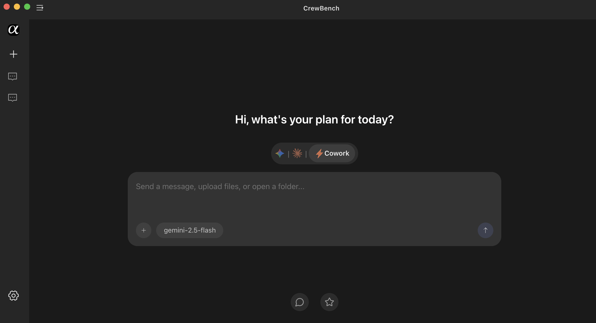
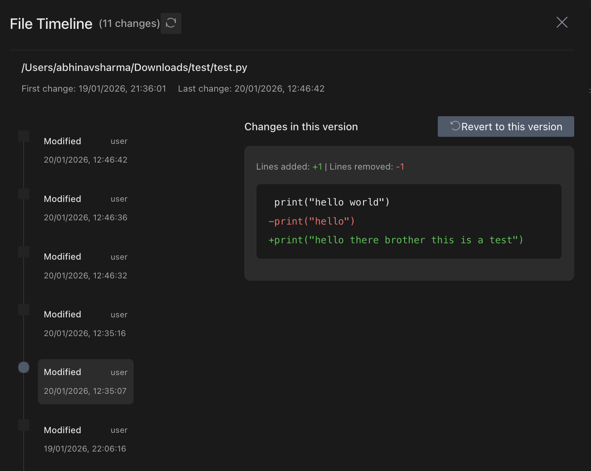

<a id="readme-top"></a>

[![Contributors][contributors-shield]][contributors-url]
[![Forks][forks-shield]][forks-url]
[![Stargazers][stars-shield]][stars-url]
[![Issues][issues-shield]][issues-url]
[![project_license][license-shield]][license-url]

<br />
<div align="center">
  <a href="https://github.com/CrewBench/CrewBench">
    
  </a>

<h3 align="center">CrewBench</h3>

  <p align="center">
    An open-source, enhanced version of Claude Code built specifically for programmers.
    <br />
    <a href="https://github.com/CrewBench/CrewBench"><strong>Explore the docs »</strong></a>
    <br />
    <br />
    <a href="https://github.com/CrewBench/CrewBench/releases">View Demo</a>
    &middot;
    <a href="https://github.com/CrewBench/CrewBench/issues/new?template=bug_report.yml">Report Bug</a>
    &middot;
    <a href="https://github.com/CrewBench/CrewBench/issues/new?template=feature_request.yml">Request Feature</a>
  </p>
</div>

<!-- TABLE OF CONTENTS -->
<details>
  <summary>Table of Contents</summary>
  <ol>
    <li>
      <a href="#overview">Overview</a>
      <ul>
        <li><a href="#core-features">Core Features</a></li>
        <li><a href="#special-features">Special Features</a></li>
        <li><a href="#technical-focus-areas">Technical Focus Areas</a></li>
        <li><a href="#our-relationship-to-aionui">Our Relationship to AionUi</a></li>
        <li><a href="#what-crewbench-does-not-do">What CrewBench Does Not Do</a></li>
      </ul>
    </li>
    <li>
      <a href="#getting-started">Getting Started</a>
      <ul>
        <li><a href="#system-requirements">System Requirements</a></li>
        <li><a href="#prerequisites">Prerequisites</a></li>
        <li><a href="#installation">Installation</a></li>
      </ul>
    </li>
    <li>
      <a href="#crewbench-usage">Usage</a>
      <ul>
        <li><a href="#cowork-with-cli-ai-agents-unified-developer-interface">Cowork With CLI AI Agents</a></li>
        <li><a href="#cowork-directly-on-your-codebase">Cowork Directly on Your Codebase</a></li>
        <li><a href="#inspect-agent-output-not-just-results">Inspect Agent Output</a></li>
        <li><a href="#file-timeline-and-action-logs">File Timeline and Action Logs</a></li>
        <li><a href="#parallel-task-execution-without-context-collision">Parallel Task Execution</a></li>
        <li><a href="#remote-coworking-and-team-workflows">Remote Coworking</a></li>
        <li><a href="#developer-controlled-interface">Developer-Controlled Interface</a></li>
      </ul>
    </li>
    <li><a href="#roadmap">Roadmap</a></li>
    <li>
      <a href="#contributing">Contributing</a>
      <ul>
        <li><a href="#how-to-contribute">How to Contribute</a></li>
        <li><a href="#contribution-guidelines">Contribution Guidelines</a></li>
      </ul>
    </li>
    <li><a href="#license">License</a></li>
    <li><a href="#contact">Contact</a></li>
    <li><a href="#acknowledgments">Acknowledgments</a></li>
  </ol>
</details>

<!-- ABOUT THE PROJECT -->

## Overview



CrewBench is a **desktop UI and control layer for AI coding agents** such as Claude Code, Gemini CLI, and Codex.

It provides **visibility, control, and rollback** over how AI agents read and modify a real codebase.

CrewBench is built on top of **[AionUi](https://github.com/iOfficeAI/AionUi) (Apache-2.0)** and inherits all upstream AionUi capabilities, while adding **developer-focused observability and guardrails**.

### Core Features

| Feature                                | Description                                                                                                           |
| -------------------------------------- | --------------------------------------------------------------------------------------------------------------------- |
| **Local Conversation Storage**         | All chats are stored **locally**, ensuring persistence, privacy, and zero cloud lock-in.                              |
| **Multi-Model Support**                | Seamlessly switch between **Gemini, OpenAI, Claude, Qwen**, and other mainstream models.                              |
| **Local Model Integration**            | Connect local models via **Ollama, LM Studio**, or any custom OpenAI-compatible endpoint (e.g. `localhost:11434/v1`). |
| **File Timeline\***                    | Every file change is recorded in a **chronological timeline** — see what changed, when, and why.                      |
| **Action Logs & Audit Trail\***        | Detailed logs of **AI actions and human actions**, enabling full observability and debugging.                         |
| **Gemini 3 Subscription Optimization** | Automatically detects active subscriptions and recommends **advanced Gemini models** when available.                  |
| **File Tree Management**               | Browse your project like a real filesystem with **drag & drop support** for files and folders.                        |
| **AI-Assisted File Organization**      | Let AI intelligently **classify, organize, and restructure folders** based on project context.                        |
| **Preview Panel (Agent Visibility)**   | Preview **9+ formats** (PDF, Word, Excel, PPT, Markdown, code, images, HTML) instantly after AI actions.              |
| **Real-Time File Tracking**            | Automatically tracks file changes with **live updates** for Markdown, code, and HTML.                                 |
| **Inline Editing & Debugging**         | Edit generated content directly and debug outputs without leaving the workspace.                                      |
| **AI Image Generation**                | Generate images using multiple models like **Gemini 2.5 Flash, Nano, Banana**.                                        |
| **Image Recognition & Editing**        | Perform AI-powered image analysis, understanding, and modifications.                                                  |
| **WebUI Remote Access**                | Access CrewBench from any device on your network via browser — desktop or mobile.                                     |
| **Local-First Data Security**          | All data is stored locally in **SQLite**, making it safe for personal or server deployment.                           |
| **Custom CSS Theming**                 | Fully customize UI colors, layout, and styles using **your own CSS**.                                                 |

### Special Features:

File Level Version Tracking and CrewBench Logging



CrewBench adds **AI-aware file version tracking**, recording every agent-initiated change:

- Full content snapshots per change
- Line-based diffs between versions
- Operation type (`create`, `write`, `delete`)
- Agent attribution
- Timestamped history per workspace

Developers can:

- Inspect how a file evolved across agent actions
- Compare versions visually
- Revert a file to any previous state

This complements Git by tracking **agent behavior**, not commits.

### Technical Focus Areas

| Focus Area                  | What It Covers                                                                                                  | Why It Matters                                                                           |
| --------------------------- | --------------------------------------------------------------------------------------------------------------- | ---------------------------------------------------------------------------------------- |
| **Observability**           | • File timelines and diffs<br>• Clear agent vs human attribution<br>• Action-level history                      | Lets developers _see exactly what happened_, who did it (human or AI), and in what order |
| **Control / Guardrails**    | • Path-based read/write restrictions<br>• Operation-level permissions<br>• Confirmation gates for risky actions | Prevents agents from touching the wrong files or making unsafe changes                   |
| **Reproducibility**         | • Inspectable agent action sequences<br>• Debugging and diagnosis of AI behavior                                | Makes AI behavior debuggable, auditable, and repeatable                                  |
| **Human + Agent Workflows** | • Continuous history across human and agent edits<br>• No context loss between steps                            | Enables seamless collaboration without losing state or intent                            |

### Our Relationship to AionUi

AionUi provides the base platform, including:

- Multi-agent orchestration
- Desktop UI infrastructure
- File system access
- Local-first execution
- Cross-platform support

CrewBench builds **on top of this foundation** and focuses specifically on **software engineering workflows**.

### What CrewBench Does Not Do

- Does not replace Git
- Does not replace an IDE
- Does not introduce new AI models
- Does not focus on prompt presets

CrewBench operates at the **control and observability layer**, not the editor or model layer.

## Getting Started

<p>
  <a href="https://github.com/CrewBench/CrewBench/releases">
    
  </a>
</p>

### System Requirements

- **macOS**: 10.15 or higher
- **Windows**: Windows 10 or higher
- **Linux**: Ubuntu 18.04+ / Debian 10+ / Fedora 32+
- **Memory**: Recommended 4GB or more
- **Storage**: At least 500MB available space

### Prerequisites

- CrewBench is a desktop application and does not require any prerequisites.

### Installation

1. Download the latest release from [here](https://github.com/CrewBench/CrewBench/releases).
2. Install the downloaded file.
3. Now you can run the `CrewBench as an Application` file.

<p align="right">(<a href="#readme-top">back to top</a>)</p>

<!-- USAGE EXAMPLES -->

## CrewBench Usage

### Cowork With CLI AI Agents (Unified Developer Interface)

If you already use command-line AI tools such as Gemini CLI, Claude Code, Codex, Qwen Code, Goose, or similar, CrewBench acts as the graphical cowork layer on top of them.

| Capability           | Description                                      |
| -------------------- | ------------------------------------------------ |
| Multi-Agent Sessions | Run multiple AI coding agents simultaneously     |
| Unified Interface    | One UI instead of multiple terminals             |
| Context Isolation    | Each agent and task runs with independent memory |
| Local Execution      | Agents run locally on your machine               |

---

### Cowork Directly on Your Codebase

Agents operate on real project files, not abstract chat outputs.

| Developer Need    | How CrewBench Supports It                  |
| ----------------- | ------------------------------------------ |
| Code Exploration  | File-tree based navigation                 |
| File Modification | Agents read and write actual project files |
| Batch Operations  | Rename, merge, and reorganize files        |
| Safe Changes      | All changes are tracked and reviewable     |

---

### Inspect Agent Output, Not Just Results

CrewBench surfaces agent outputs as first-class artifacts.

| Visibility Feature   | Description                                     |
| -------------------- | ----------------------------------------------- |
| Multi-Format Preview | Code, Markdown, HTML, documents, images, diffs  |
| Live File Sync       | Previews update automatically when files change |
| Inline Editing       | Edit or refine agent output directly            |
| Change Awareness     | See what changed, not just the final state      |

---

### File Timeline and Action Logs

CrewBench is designed for engineering-grade observability.

| Observability Tool | Purpose                                        |
| ------------------ | ---------------------------------------------- |
| File Timeline      | Chronological history of every file change     |
| Action Logs        | Full audit trail of agent and human actions    |
| Change Attribution | Clear mapping of who (or which agent) did what |
| Reproducibility    | Inspect and debug agent behavior               |

---

### Parallel Task Execution Without Context Collision

Multiple tasks can run in parallel without contaminating context.

| Workflow Pattern  | Support                                |
| ----------------- | -------------------------------------- |
| Parallel Sessions | Multiple active tasks at the same time |
| Isolated Memory   | No cross-task confusion                |
| Long-Running Work | Persistent sessions for ongoing work   |

---

### Remote Coworking and Team Workflows

Control and observe your agents remotely while keeping execution local.

| Capability          | Description                                           |
| ------------------- | ----------------------------------------------------- |
| WebUI Access        | Control CrewBench from other devices on the network   |
| Local Agent Control | Agents continue running on the host machine           |
| Server Deployment   | Suitable for self-hosted setups                       |
| CrewBench Teams     | Collaborative multi-developer workflows (coming soon) |

---

### Developer-Controlled Interface

CrewBench adapts to your workflow, not the other way around.

| Customization      | Description                                           |
| ------------------ | ----------------------------------------------------- |
| CSS Customization  | Full control over UI appearance                       |
| Layout Flexibility | Shape the interface around your workflow              |
| Personal Setup     | Make CrewBench feel like your development environment |

## Roadmap

- [Completed] File Timeline
- [In Progress] Action Logs
- [Not Started] GuardRails

<p align="right">(<a href="#readme-top">back to top</a>)</p>

<!-- CONTRIBUTING -->

## Contributing

CrewBench is built in the open and contributions are welcome.  
Before writing code, please start with an issue so changes can be discussed and aligned with the project direction.

### How to Contribute

1. **Open an Issue First**
   - Describe the bug, feature request, or improvement
   - Provide context, use cases, and (if applicable) screenshots or logs
   - Label the issue appropriately (bug, enhancement, discussion)

2. **Fork the Repository**  
   Create your own fork to work on the change.

3. **Create a Feature Branch**

   ```bash
   git checkout -b feature/your-feature-name

   ```

4. **Make Your Changes**
   - Keep changes focused and scoped to the issue
   - Follow existing code style and conventions
   - Add logs or comments where behavior may not be obvious

5. **Commit Your Changes**

   ```bash
   git commit -m "feat: describe your change clearly"
   ```

6. **Push to Your Fork**

   ```bash
   git push origin feature/your-feature-name
   ```

7. **Open a Pull Request**
   - Reference the related issue
   - Explain what changed and why
   - Include screenshots or demos if UI-related

### Contribution Guidelines

- Prefer small, reviewable pull requests
- Avoid introducing breaking changes without discussion
- Keep developer experience and observability in mind
- All code should respect CrewBench’s local-first and transparent design principles

Thank you for helping improve CrewBench.

<p align="right">(<a href="#readme-top">back to top</a>)</p>

### Top contributors:

<a href="https://github.com/CrewBench/CrewBench/graphs/contributors">
  
</a>

<!-- LICENSE -->

## License

Distributed under the project_license. See `LICENSE.txt` for more information.

<p align="right">(<a href="#readme-top">back to top</a>)</p>

<!-- CONTACT -->

## Contact

Abhinav Sharma - [@abhinavsharma](https://twitter.com/abhinavsharma)

Project Link: [https://github.com/CrewBench/CrewBench](https://github.com/CrewBench/CrewBench)

<p align="right">(<a href="#readme-top">back to top</a>)</p>

<!-- ACKNOWLEDGMENTS -->

## Acknowledgments

- [Electron](https://www.electronjs.org/) — for enabling cross-platform desktop application development
- [Node.js](https://nodejs.org/) — for the underlying runtime and tooling ecosystem
- [SQLite](https://www.sqlite.org/) — for reliable, local-first data storage
- [OpenAI](https://openai.com/) — for OpenAI-compatible APIs and ecosystem standards
- [Google Gemini](https://deepmind.google/technologies/gemini/) — for multimodal and large-context model support
- [Anthropic Claude](https://www.anthropic.com/) — for advancing safe and capable coding agents

<p align="right">(<a href="#readme-top">back to top</a>)</p>

[contributors-shield]: https://img.shields.io/github/contributors/CrewBench/CrewBench.svg?style=for-the-badge
[contributors-url]: https://github.com/CrewBench/CrewBench/graphs/contributors
[forks-shield]: https://img.shields.io/github/forks/CrewBench/CrewBench.svg?style=for-the-badge
[forks-url]: https://github.com/CrewBench/CrewBench/network/members
[stars-shield]: https://img.shields.io/github/stars/CrewBench/CrewBench.svg?style=for-the-badge
[stars-url]: https://github.com/CrewBench/CrewBench/stargazers
[issues-shield]: https://img.shields.io/github/issues/CrewBench/CrewBench.svg?style=for-the-badge
[issues-url]: https://github.com/CrewBench/CrewBench/issues
[license-shield]: https://img.shields.io/github/license/CrewBench/CrewBench.svg?style=for-the-badge
[license-url]: https://github.com/CrewBench/CrewBench/blob/master/LICENSE.txt
[product-screenshot]: images/screenshot.png
